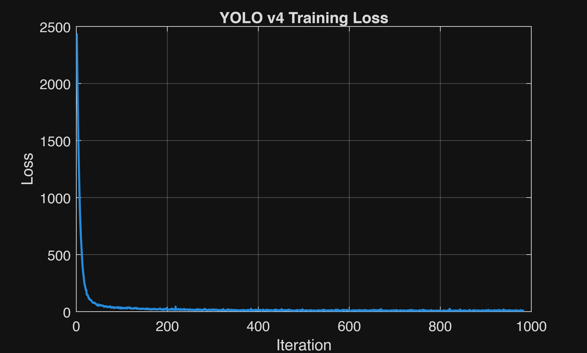
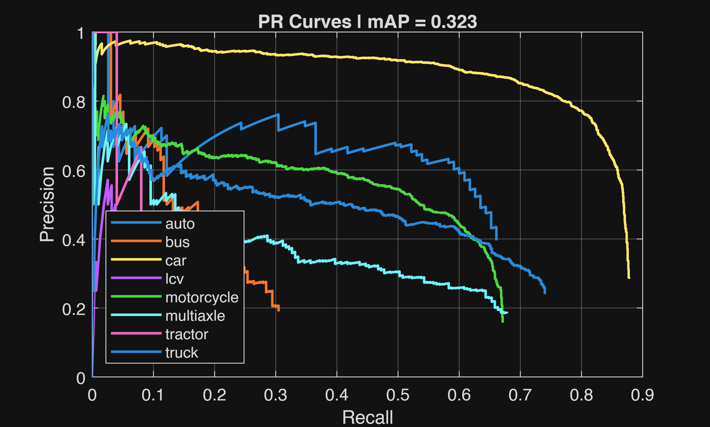
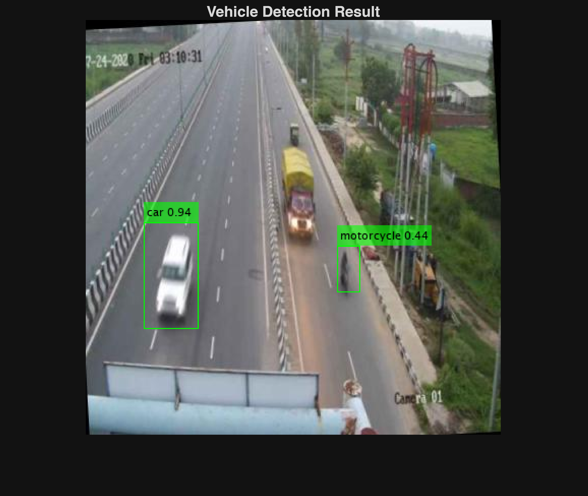

# Vehicle Detection with YOLOv4 in MATLAB

<div align="center">


</div>

---

### Learning Objectives

By the end of this workshop, participants will be able to:

- ✅ Understand how YOLO (You Only Look Once) object detection works
- ✅ Convert YOLO-format annotations to MATLAB compatible format
- ✅ Apply data augmentation for improved model performance
- ✅ Use transfer learning to fine-tune a pre-trained model
- ✅ Evaluate object detection models using mAP metrics
- ✅ Deploy a trained detector in a MATLAB GUI using App Designer

---

## 🎯 Project Overview

We built a vehicle detection system that can identify **8 different vehicle types** from road images:

| Class         | Description               | AP (2 epochs) |
| ------------- | ------------------------- | ------------- |
| 🚗 car        | Passenger vehicles        | 0.78          |
| 🛺 auto       | Auto-rickshaws            | 0.45          |
| 🏍️ motorcycle | Two-wheelers              | 0.40          |
| 🚚 truck      | Heavy trucks              | 0.37          |
| 🚌 bus        | Public transport          | 0.17          |
| 🚛 multiaxle  | Multi-axle vehicles       | 0.27          |
| 🚜 tractor    | Farm vehicles             | 0.10          |
| 🚐 lcv        | Light commercial vehicles | 0.05          |

**Overall mAP:** 0.32 (baseline with 2 epochs)

---

## 📦 Prerequisites

### MATLAB Toolboxes Required

Go to **Home → Add-Ons → Manage Add-Ons** and verify:

| Toolbox                      | Purpose                           |
| ---------------------------- | --------------------------------- |
| Deep Learning Toolbox        | Neural network training engine    |
| Computer Vision Toolbox      | YOLO detector, bounding box tools |
| CV Toolbox Model for YOLO v4 | Pre-trained backbone weights      |
| Statistics & ML Toolbox      | Data splitting utilities          |

### MATLAB Version

- **Required:** MATLAB R2025b or later
- Some function signatures differ in older versions

### Hardware Requirements

| Component | Minimum  | Recommended                  |
| --------- | -------- | ---------------------------- |
| RAM       | 8 GB     | 16 GB                        |
| GPU       | CPU only | NVIDIA GPU with CUDA support |
| Storage   | 5 GB     | 10 GB                        |

---

## 🗂️ Dataset

We use the **Vehicle Detection 8 Classes** dataset from Kaggle:

- **Source:** [Vehicle Detection 8 Classes | Object Detection](https://www.kaggle.com/datasets/sakshamjn/vehicle-detection-8-classes-object-detection/data)
- **Images:** 6,575 road images from Indian highways
- **Format:** YOLO annotation format

### Dataset Structure

```
train/
├── images/          # .jpg photos
└── labels/
    ├── classes.txt  # 8 class names
    └── *.txt        # One label file per image
```

Each label file contains:

```matlab
class_id  x_center  y_center  width  height
```

_(Coordinates normalized between 0 and 1)_

---

## 🚀 Quick Start

### 1. Download the Dataset

```bash
# Download from Kaggle and extract to your project folder
# Expected structure:
# C:\Users\<user>\Documents\MATLAB\VehicleDetectionYOLO\
# ├── train/
# │   ├── images/
# │   └── labels/
```

### 2. Run the Live Script

```matlab
% Open MATLAB R2025b
% File -> Open -> Select VehicleDetectionYOLO.mlx

% Run each cell sequentially, or press "Run All" to execute the entire script
```

### 3. Train or Load a Pre-trained Model

```matlab
% Set this flag in the live script:
doTraining = false;  % true to train, false to load saved model
```

---

## 📁 Project Structure

```
GROUP-PROJECT/
├── VehicleDetectionYOLO.mlx       # Main live script (workshop)
├── VehicleDetectionYOLO-v1.md     # Detailed workshop guide
├── trainedVehicleDetector.mat     # Saved trained model
├── checkpoints/                    # Training checkpoints
├── train/                          # Training data
│   ├── images/                     # .jpg images
│   └── labels/                     # YOLO format labels
├── test/                           # Test data
└── README.md                       # This file
```

---

## 🔬 Workshop Outline

### Section 1 — Introduction (~5 min)

- What is YOLO v4?
- Why use YOLO for object detection?
- Tiny YOLOv4 variant overview

### Section 2 — Getting the Data (~10 min)

- Dataset overview and structure
- Reading class names dynamically
- **Key Challenge:** Converting YOLO labels to MATLAB format
- Visualizing samples with bounding boxes
- Splitting data (60/20/20)

### Section 3 — YOLOv4 Architecture (~10 min)

- Transfer learning concept
- Data augmentation (HSV jitter, flip, scale)
- Estimating anchor boxes with k-means
- Assembling the detector

### Section 4 — Training (~15 min)

- GPU availability check
- Training options explanation
- Running the training process
- Monitoring training loss

### Section 5 — Testing & Evaluation (~10 min)

- Running inference on test set
- Computing mAP and per-class AP
- Precision-Recall curves
- Visualizing detection results

### Section 6 — Building the GUI (~5 min)

- App Designer overview
- GUI layout design _(future enhancement)_

### Section 7 — Conclusion (~5 min)

- Summary of what we built
- Key lessons learned
- Future improvements

---

## 📊 Training Results

### Loss Curve



The loss drops from ~2440 to ~32 in the first 100 iterations, demonstrating the effectiveness of transfer learning.

### Precision-Recall Curves



### Sample Detection Result



---

## 📖 Resources

| Resource            | Link                                                                                                                                 |
| ------------------- | ------------------------------------------------------------------------------------------------------------------------------------ |
| MATLAB YOLO v4 Docs | [Getting Started with YOLO v4](https://www.mathworks.com/help/vision/ug/getting-started-with-yolo-v4.html)                           |
| Dataset             | [Vehicle Detection 8 Classes on Kaggle](https://www.kaggle.com/datasets/sakshamjn/vehicle-detection-8-classes-object-detection/data) |
| YOLO Paper          | [YOLOv4: Optimal Speed and Accuracy of Object Detection](https://arxiv.org/abs/2004.10934)                                           |

---

## 📄 License

This project is licensed under the MIT License - see the [LICENSE](LICENSE) file for details.

---

## 🙏 Acknowledgments

- **Kaggle** for the Vehicle Detection 8 Classes dataset
- **MathWorks** for the YOLO v4 Computer Vision Toolbox Model
- The original YOLO authors for the groundbreaking architecture

---

<div align="center">

**Made with ❤️ using MATLAB**

[](#vehicle-detection-with-yolov4-in-matlab)

</div>
