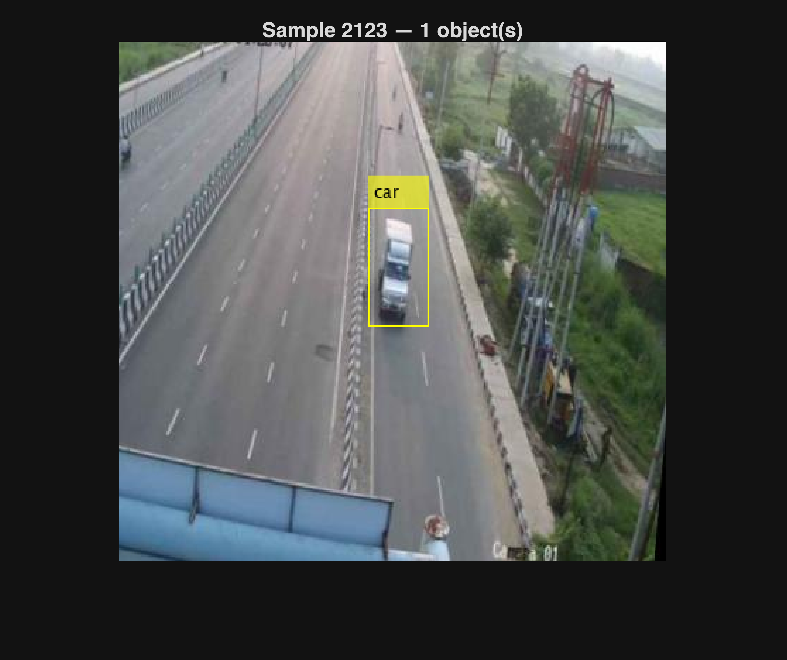
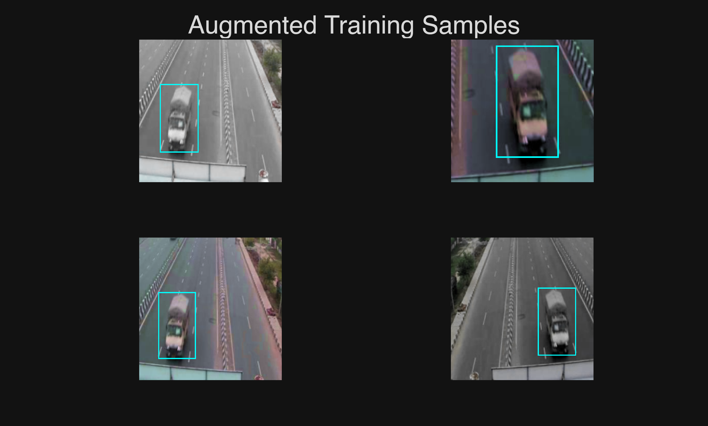

#  Vehicle Detection with YOLOv4 in MATLAB
## Workshop Walkthrough Guide
-  Format: Live coding walkthrough | Duration: ~45–55 mins   
-  Audience: Engineering students with basic MATLAB experience   
-  Goal: Train a real\-time vehicle detector from scratch and deploy it in a MATLAB GUI 
# Section 1 — Introduction
## What is YOLO v4?

YOLO stands for \*You Only Look Once\*. Unlike older detection methods that scan an image multiple times in a sliding window, YOLO processes the entire image in a single forward pass through the network. This makes it extremely fast — suitable for real\-time applications.


Version 4 specifically introduces several improvements:

-  CSPDarknet53 backbone for better feature extraction 
-  PANet path aggregation for multi\-scale detection 
-  Mosaic data augmentation and anchor box clustering 

We're using the Tiny YOLOv4 variant which is a lighter version.

## Prerequisites

Before we begin, make sure you have these MATLAB toolboxes installed. Go to Home → Add\-Ons → Manage Add\-Ons and verify:

-  Deep Learning Toolbox | Core neural network training engine | 
-  Computer Vision Toolbox | YOLO detector, bounding box tools, datastores | 
-  CV Toolbox Model for YOLO v4 | Pre\-trained `tiny-yolov4-coco` backbone weights | 
-  Statistics & ML Toolbox | Data splitting utilities | 

Also confirm you're on MATLAB R2025b — some function signatures differ in older versions.

# Section 2 — Getting the Data
## Dataset Overview

We're using the Vehicle Detection 8 Classes dataset from Kaggle, which contains 6,575 road images collected from Indian highways. Each image comes with annotation files in YOLO format.


The dataset folder structure looks like this:

```matlab
% train/
% ├── images/   ← .jpg photos
% └── labels/
%     ├── classes.txt   ← 8 class names
%     └── *.txt         ← one label file per image
```

Each `.txt` label file contains one line per object in the format:

```matlab
class_id  x_center  y_center  width  height
```

where all coordinates are normalized between 0 and 1 relative to the image size. MATLAB needs them as absolute pixel integers — we'll convert that shortly.

## Step 2.1 — Project Setup

Let's start. Open MATLAB R2025b, create a new Live Script (`Home → New → Live Script`), save it as `VehicleDetectionYOLO.mlx`, then run this first cell:

```matlab
%% Setup
clc; clear; close all;

% Set your project root — change this path to where you extracted the zip
projectRoot = 'C:\Users\<user>\Documents\MATLAB\VechicleDetecionYOLO';  % ← EDIT THIS
datasetPath = fullfile(projectRoot, 'train');

cd(projectRoot);
addpath(genpath(projectRoot));
disp('Environment ready.');
```

```matlabTextOutput
Environment ready.
```


>  Tip for audience: Change `projectRoot` to wherever you unzipped the dataset. The `addpath(genpath(...))` call ensures MATLAB can find all helper functions we'll define later.

## Step 2.2 — Read Class Names

Instead of hardcoding class names, we read them directly from `classes.txt` so the code works even if the dataset changes:

```matlab

%% Read Class Names
classFile = fullfile(datasetPath, 'labels', 'classes.txt');
fid = fopen(classFile, 'r');
classNames = {};
while ~feof(fid)
    line = strtrim(fgetl(fid));
    if ~isempty(line)
        classNames{end+1} = line; %#ok<SAGROW>
    end
end
fclose(fid);

disp('Classes found:');
```

```matlabTextOutput
Classes found:
```

```matlab
disp(classNames);
```

```matlabTextOutput
    {'auto'}    {'bus'}    {'car'}    {'lcv'}    {'motorcycle'}    {'multiaxle'}    {'tractor'}    {'truck'}
```

```matlab
% Expected: {'auto','bus','car','lcv','motorcycle','multiaxle','tractor','truck'}
```

Eight classes confirmed. Now let's scan for all images:

```matlab
%% Scan Files
imageDir = fullfile(datasetPath, 'images');
labelDir = fullfile(datasetPath, 'labels');

imageFiles = dir(fullfile(imageDir, '*.jpg'));
imageFiles = {imageFiles.name}';
numImages  = numel(imageFiles);
fprintf('Total images found: %d\n', numImages);
```

```matlabTextOutput
Total images found: 6575
```

## Step 2.3 — Convert Labels to MATLAB Format

> ⚠️ Problem we encountered: This was the trickiest part of the whole project. MATLAB's `boxLabelDatastore` is strict — it requires bounding boxes as M×4 matrices of positive integers, but YOLO labels are stored as normalized floating\-point values. We hit three separate errors before getting this right.


&nbsp;&nbsp;&nbsp;&nbsp; Problem 1: `boxLabelDatastore` threw: \*"The number of bounding boxes does not equal the number of labels in row 2."\*  


&nbsp;&nbsp;&nbsp;&nbsp; Cause: The `categorical()` call was producing a row vector (1×M) instead of a column vector (M×1), so the count didn't match the M rows of the bbox matrix.  


&nbsp;&nbsp;&nbsp;&nbsp; Fix: Added a transpose `'` → `classNames(classIds)'`


&nbsp;&nbsp;&nbsp;&nbsp; Problem 2: `validateInputData` threw: \*"Bounding box data must be M\-by\-4 matrices of positive integer values."\*  


&nbsp;&nbsp;&nbsp;&nbsp; Cause: After converting from normalized floats (e.g. `0.523 × 640 = 334.72`), the values were still floating point. MATLAB's validator checks that values are whole numbers.  


&nbsp;&nbsp;&nbsp;&nbsp; Fix: Added `bboxes = round(bboxes)` immediately after conversion.


    


&nbsp;&nbsp;&nbsp;&nbsp; Problem 3: Same error on three specific images even after rounding.  


&nbsp;&nbsp;&nbsp;&nbsp; Cause: Some boxes were positioned near the image edge. After rounding, `x + w - 1` exceeded the image width — the validator formula checks `x + w - 1 <= W`, not `x + w <= W` (off\-by\-one).  


&nbsp;&nbsp;&nbsp;&nbsp; Fix: Changed the clamp formula from `W - x` to `W - x + 1`.

```matlab
%% Convert Labels to MATLAB Format (Fixed)
imageFilenames = {};
bboxCell       = {};
labelCell      = {};

for i = 1:numImages
    imgName = imageFiles{i};
    imgPath = fullfile(imageDir, imgName);
    lblName = strrep(imgName, '.jpg', '.txt');
    lblPath = fullfile(labelDir, lblName);

    if ~isfile(lblPath), continue; end

    info = imfinfo(imgPath);
    W = info.Width;
    H = info.Height;

    rawData = readmatrix(lblPath, 'FileType', 'text');
    if isempty(rawData) || size(rawData, 2) < 5, continue; end

    % Each row: [class_id, x_center, y_center, w, h]  (normalized 0-1)
    classIds = rawData(:, 1) + 1;
    xc = rawData(:, 2) .* W;
    yc = rawData(:, 3) .* H;
    bw = rawData(:, 4) .* W;
    bh = rawData(:, 5) .* H;

    % Convert to [x_topleft, y_topleft, width, height]
    bboxes = [xc - bw/2,  yc - bh/2,  bw,  bh];

    % ── FIXES START HERE ──────────────────────────────────────────

    % Fix 1: Round everything to integers
    bboxes = round(bboxes);

    % Fix 2: Clamp top-left corner to minimum of 1
    bboxes(:,1) = max(bboxes(:,1), 1);
    bboxes(:,2) = max(bboxes(:,2), 1);

    % Fix 3: Clamp width/height so box does not exceed image boundary
    %         validator checks: x + w - 1 <= W  and  y + h - 1 <= H
    bboxes(:,3) = min(bboxes(:,3), W - bboxes(:,1) + 1);
    bboxes(:,4) = min(bboxes(:,4), H - bboxes(:,2) + 1);

    % Fix 4: Remove boxes where width or height is still 0 or negative
    valid = bboxes(:,3) >= 1 & bboxes(:,4) >= 1;
    bboxes   = bboxes(valid, :);
    classIds = classIds(valid);

    % ── FIXES END HERE ────────────────────────────────────────────

    if isempty(bboxes), continue; end

    % Labels must be M-by-1 categorical column vector, same M as bbox rows
    labels = categorical(classNames(classIds)', classNames);

    assert(size(bboxes,1) == numel(labels), ...
        'Mismatch at image %d: %d boxes vs %d labels', i, size(bboxes,1), numel(labels));

    imageFilenames{end+1} = imgPath;
    bboxCell{end+1}       = bboxes;
    labelCell{end+1}      = labels;
end

% Build final table
imageFilenames = imageFilenames(:);
bboxCell       = bboxCell(:);
labelCell      = labelCell(:);

vehicleDataset = table(imageFilenames, bboxCell, labelCell, ...
    'VariableNames', {'imageFilename', 'bbox', 'labels'});

fprintf('Valid samples: %d / %d\n', height(vehicleDataset), numImages);
```

```matlabTextOutput
Valid samples: 6561 / 6575
```


We lost 14 images — these had either missing label files or completely invalid boxes (objects annotated right on the image border). That's less than 0.2% of the dataset, so no concern.

## Step 2.4 — Visualise a Sample

Let's sanity\-check the conversion by visualising a random training sample:

```matlab
%% Visualise Sample
sampleIdx = randi(height(vehicleDataset));
I         = imread(vehicleDataset.imageFilename{sampleIdx});
bboxes    = vehicleDataset.bbox{sampleIdx};
labels    = vehicleDataset.labels{sampleIdx};
labelStr  = cellstr(string(labels));

annotated = insertObjectAnnotation(I, 'rectangle', bboxes, labelStr, ...
    'Color', 'yellow', 'FontSize', 12);
imshow(annotated);
title(sprintf('Sample %d — %d object(s)', sampleIdx, size(bboxes,1)));
```



The yellow boxes and class labels look correctly placed — conversion is working.

## Step 2.5 — Split and Create Datastores

We split 60% for training, 20% for validation, 20% for testing. We fix `rng(42)` so the split is reproducible:

```matlab

%% Split Dataset  60% train | 20% val | 20% test
rng(42);  % random_state=42
n = height(vehicleDataset);
idx = randperm(n);

trainEnd = floor(0.60 * n);
valEnd   = floor(0.80 * n);

trainData = vehicleDataset(idx(1:trainEnd), :);
valData   = vehicleDataset(idx(trainEnd+1:valEnd), :);
testData  = vehicleDataset(idx(valEnd+1:end), :);

fprintf('Train: %d | Val: %d | Test: %d\n', ...
    height(trainData), height(valData), height(testData));
```

```matlabTextOutput
Train: 3936 | Val: 1312 | Test: 1313
```


Now we wrap the tables into MATLAB datastores, which handle batching and parallel loading during training:

```matlab
%% Create Datastores 
% boxLabelDatastore 2-column table format:
%   col 1 = bbox  (cell of M-by-4 matrices)
%   col 2 = labels (cell of M-by-1 categoricals)

imdsTrain = imageDatastore(trainData.imageFilename);
bldsTrain = boxLabelDatastore(table(trainData.bbox, trainData.labels));

imdsVal   = imageDatastore(valData.imageFilename);
bldsVal   = boxLabelDatastore(table(valData.bbox, valData.labels));

imdsTest  = imageDatastore(testData.imageFilename);
bldsTest  = boxLabelDatastore(table(testData.bbox, testData.labels));

dsTrain = combine(imdsTrain, bldsTrain);
dsVal   = combine(imdsVal,   bldsVal);
dsTest  = combine(imdsTest,  bldsTest);

validateInputData(dsTrain);
validateInputData(dsVal);
validateInputData(dsTest);
disp('All datastores validated.');
```

```matlabTextOutput
All datastores validated.
```

# Section 3 — YOLOv4 Architecture 
## Transfer Learning

Training a deep network from random weights on 6,500 images would likely not converge well. Instead we use transfer learning — we start from `tiny-yolov4-coco`, a network already trained on the 80\-class COCO dataset (Common Objects in Context). The backbone already understands edges, textures, and shapes. We only need to retrain the detection heads to output our 8 vehicle classes instead of COCO's 80.

## Helper Functions
```matlab
function data = augmentVehicleData(A)
% Random horizontal flip + scale jitter + HSV color jitter
data = cell(size(A));
for ii = 1:size(A,1)
    I      = A{ii,1};
    bboxes = A{ii,2};
    labels = A{ii,3};
    sz     = size(I);

    % Color jitter (HSV)
    if ndims(I) == 3 && sz(3) == 3
        I = jitterColorHSV(I, ...
            'Hue',        0.1, ...
            'Saturation', 0.2, ...
            'Brightness', 0.2, ...
            'Contrast',   0.0);
    end

    % Random horizontal flip + scale (±10%)
    tform = randomAffine2d('XReflection', true, 'Scale', [0.9 1.1]);
    rout  = affineOutputView(sz, tform, 'BoundsStyle', 'centerOutput');
    I     = imwarp(I, tform, 'OutputView', rout);
    [bboxes, indices] = bboxwarp(bboxes, tform, rout, 'OverlapThreshold', 0.25);

    if isempty(indices)
        data(ii,:) = A(ii,:);   % fallback to original if all boxes lost
    else
        data(ii,:) = {I, bboxes, labels(indices)};
    end
end
end

function data = preprocessForAnchors(data, targetSize)
% Resize images and scale bounding boxes for anchor estimation
for ii = 1:size(data,1)
    I    = data{ii,1};
    iSz  = size(I);
    bbox = data{ii,2};
    I    = im2single(imresize(I, targetSize(1:2)));
    sc   = targetSize(1:2) ./ iSz(1:2);
    bbox = bboxresize(bbox, sc);
    data(ii,1:2) = {I, bbox};
end
end
```
## Data Augmentation

Augmentation artificially expands the training set by applying random transforms. Each time the network sees an image, it sees a slightly different version — which prevents overfitting. We apply three augmentations:

-  HSV jitter — randomly shifts hue, saturation, and brightness (handles different lighting conditions) 
-  Horizontal flip — mirrors the image (vehicles look the same from either side) 
-  Scale jitter ±10% — slight zoom in/out (handles vehicles at different distances) 
```matlab
%% Data Augmentation
augmentedTrainData = transform(dsTrain, @augmentVehicleData);

% Preview augmented samples
figure('Name', 'Augmentation Preview');
for k = 1:4
    subplot(2,2,k);
    sample = read(augmentedTrainData);
    I      = sample{1};
    boxes  = sample{2};
    I = insertShape(I, 'Rectangle', boxes, 'Color', 'cyan', 'LineWidth', 2);
    imshow(I);
    reset(augmentedTrainData);
end
sgtitle('Augmented Training Samples');
```


## Estimating Anchor Boxes

YOLO doesn't predict raw bounding boxes — it predicts offsets from pre\-defined anchor boxes. Anchors are template shapes (width × height) derived from the actual object sizes in your dataset. Using good anchors means the network has less to learn.


We use `estimateAnchorBoxes` with k\-means clustering to find the 6 most representative box shapes from our training data. We then sort them by area and assign the 3 largest to the first detection head (for big objects) and the 3 smallest to the second head (for small objects):

```matlab
inputSize  = [416 416 3];   % 416 is standard for tiny YOLO
numAnchors = 6;

rng(42);
trainForAnchors = transform(dsTrain, @(d) preprocessForAnchors(d, inputSize));
[anchors, meanIoU] = estimateAnchorBoxes(trainForAnchors, numAnchors);
fprintf('Estimated anchors (mean IoU = %.3f):\n', meanIoU);
```

```matlabTextOutput
Estimated anchors (mean IoU = 0.742):
```

```matlab
disp(anchors);
```

```matlabTextOutput
    53    23
   241    97
   103    47
    66    38
   155    68
    28    16
```


A mean IoU of 0.742 means our anchor boxes overlap with the actual ground truth boxes by about 74% on average — that's a good fit. Now we sort them:

```matlab
% Sort by area — large anchors → early detection heads
areas     = anchors(:,1) .* anchors(:,2);
[~, order] = sort(areas, 'descend');
anchors   = anchors(order, :);

anchorBoxes = { anchors(1:3, :); anchors(4:6, :) };
```
## Assembling the Detector

Now we create the actual network. `yolov4ObjectDetector` takes the backbone name, our class names, and the anchor boxes, and wires everything together:

```matlab
%% Create YOLO v4 Detector
detector = yolov4ObjectDetector( ...
    'tiny-yolov4-coco', ...
    classNames, ...
    anchorBoxes, ...
    'InputSize', inputSize);

disp('Detector created:');
```

```matlabTextOutput
Detector created:
```

```matlab
disp(detector);
```

```matlabTextOutput
  yolov4ObjectDetector with properties:

             Network: [1x1 dlnetwork]
         AnchorBoxes: {2x1 cell}
          ClassNames: {8x1 cell}
           InputSize: [416 416 3]
    PredictedBoxType: 'axis-aligned'
           ModelName: 'tiny-yolov4-coco'
```


The detector is ready. The backbone weights are loaded from COCO — we just need to train the heads for our 8 classes.

# Section 4 — Training the Model
## GPU Check

Before setting training options, we detect what hardware is available:

```matlab
%% Check GPU availability
try
    gpu = gpuDevice;
    gpuAvailable = true;
    fprintf('GPU detected: %s (%.1f GB)\n', gpu.Name, gpu.TotalMemory/1e9);
    execEnv = 'gpu';
catch
    gpuAvailable = false;
    fprintf('No GPU detected. Using CPU.\n');
    execEnv = 'cpu';
end
```

```matlabTextOutput
GPU detected: NVIDIA GeForce RTX 3050 Ti Laptop GPU (4.3 GB)
```

## Training Options
```matlab
%% Training Options
checkpointDir = fullfile(projectRoot, 'checkpoints');
if ~exist(checkpointDir, 'dir'), mkdir(checkpointDir); end

options = trainingOptions('adam', ...
    'GradientDecayFactor',        0.9, ...
    'SquaredGradientDecayFactor', 0.999, ...
    'InitialLearnRate',           0.001, ...
    'LearnRateSchedule',          'none', ...
    'MiniBatchSize',              8, ...        
    'L2Regularization',           0.0005, ...
    'MaxEpochs',                  2, ...        
    'Shuffle',                    'every-epoch', ...
    'VerboseFrequency',           20, ...
    'ValidationData',             dsVal, ...
    'ValidationFrequency',        100, ...
    'CheckpointPath',             checkpointDir, ...
    'OutputNetwork',              'best-validation-loss', ...
    'ExecutionEnvironment',       execEnv, ...    % GPU if available
    'DispatchInBackground',       true, ...
    'ResetInputNormalization',    true);
```

**Key settings to highlight for the audience:**


Option: OutputNetwork


Value: best\-validation\-loss


Meaning: Saves the epoch with lowest validation loss, not the last one


Option: CheckpointPath


Value: checkpoints/


Meaning: Auto\-saves after every epoch — useful if training crashes


Option: DispatchInBackground


Value: true


Meaning: Loads next batch while GPU trains the current one


Option: MaxEpochs


Value: 2


Meaning: For demo purposes — use 20+ for production

## Running the Training
```matlab
%% Train Detector
doTraining = true;   % Set to false to skip and load a saved detector
if doTraining
    tic;  % Start timer
    fprintf('Starting training on %s...\n', upper(execEnv));
    [detector, trainingInfo] = trainYOLOv4ObjectDetector( ...
        augmentedTrainData, detector, options);
    elapsedTime = toc;  % Stop timer
    timeStr = datestr(elapsedTime/86400, 'HH:MM:SS');
    fprintf('Training complete in %s (%.1f seconds)\n', timeStr, elapsedTime);
    % Save trained detector
    save(fullfile(projectRoot, 'trainedVehicleDetector.mat'), 'detector');
else
    % Load previously trained detector
    load(fullfile(projectRoot, 'trainedVehicleDetector.mat'), 'detector');
    disp('Loaded pre-trained detector.');
end
```

```matlabTextOutput
Starting training on GPU...
Computing Input Normalization Statistics.

*************************************************************************
Training a YOLO v4 Object Detector for the following object classes:

* auto
* bus
* car
* lcv
* motorcycle
* multiaxle
* tractor
* truck

 
    Epoch    Iteration    TimeElapsed    LearnRate    TrainingLoss    ValidationLoss
    _____    _________    ___________    _________    ____________    ______________
      1          1         00:00:13        0.001         2439.6           2190.2    
      1         20         00:01:02        0.001         207.61                     
      1         40         00:01:26        0.001         78.748                     
      1         60         00:02:05        0.001         50.05                      
      1         80         00:02:51        0.001         40.059                     
      1         100        00:03:32        0.001         32.071           32.255    
      1         120        00:06:13        0.001         27.078                     
      1         140        00:06:29        0.001          26.2                      
      1         160        00:06:49        0.001         20.059                     
      1         180        00:07:02        0.001         21.589                     
      1         200        00:07:10        0.001         21.866           19.697    
      1         220        00:07:42        0.001         17.487                     
      1         240        00:07:52        0.001         16.212                     
      1         260        00:08:00        0.001         11.625                     
      1         280        00:08:09        0.001         19.627                     
      1         300        00:08:18        0.001         20.452           15.374    
      1         320        00:08:48        0.001         15.298                     
      1         340        00:08:56        0.001         17.511                     
      1         360        00:09:06        0.001         10.533                     
      1         380        00:09:15        0.001         9.1131                     
      1         400        00:09:24        0.001         14.357           12.695    
      1         420        00:10:02        0.001         16.085                     
      1         440        00:10:11        0.001         13.704                     
      1         460        00:10:24        0.001         13.625                     
      1         480        00:10:38        0.001         8.9796                     
      2         500        00:10:55        0.001         11.735           10.866    
      2         520        00:11:25        0.001         9.1397                     
      2         540        00:11:33        0.001         8.9496                     
      2         560        00:11:40        0.001         12.356                     
      2         580        00:11:48        0.001         10.737                     
      2         600        00:11:55        0.001         12.893           10.191    
      2         620        00:12:26        0.001         10.096                     
      2         640        00:12:34        0.001         9.7817                     
      2         660        00:12:40        0.001         12.145                     
      2         680        00:12:49        0.001         9.1929                     
      2         700        00:12:57        0.001         7.3471           9.1756    
      2         720        00:13:34        0.001         12.136                     
      2         740        00:13:48        0.001         11.698                     
      2         760        00:14:13        0.001         9.8006                     
      2         780        00:14:32        0.001         13.907                     
      2         800        00:14:50        0.001         6.7586           8.743     
      2         820        00:15:47        0.001         19.786                     
      2         840        00:16:03        0.001         11.792                     
      2         860        00:16:14        0.001         8.3946                     
      2         880        00:16:56        0.001         8.1749                     
      2         900        00:17:20        0.001         11.515           8.9752    
      2         920        00:17:58        0.001         7.7451                     
      2         940        00:18:08        0.001         10.059                     
      2         960        00:18:17        0.001         6.4811                     
      2         980        00:18:23        0.001         9.6218                     
      2         984        00:18:24        0.001         6.2452           8.7425    

*************************************************************************
Detector training complete.
*************************************************************************
Training complete in 00:23:07 (1387.3 seconds)
```


Training finished in 23 minutes. Notice how the loss drops rapidly in the first 100 iterations (from ~2400 down to ~32) — this is the transfer learning effect. The backbone already knows how to see; it just needed to learn our class labels.


The model is saved as `trainedVehicleDetector.mat`. Next time, set `doTraining = false` to skip straight to inference.

## Plot Training Loss
```matlab
%% Plot Training Loss
if doTraining && ~isempty(trainingInfo)
    figure('Name', 'Training Loss');
    plot(trainingInfo.TrainingLoss, 'LineWidth', 1.5);
    xlabel('Iteration'); ylabel('Loss');
    title('YOLO v4 Training Loss');
    grid on;
end
```


The curve shows a healthy steep descent followed by gradual convergence — exactly what we want to see.

# Section 5 — Testing & Evaluation
## Running Inference on the Test Set

We evaluate on the held\-out test set (1,313 images the network has never seen). We use a low threshold of `0.01` here to capture all detections across the full precision\-recall range:

```matlab
%% Evaluate on Test Set
detectionResults = detect(detector, dsTest, 'Threshold', 0.01);

metrics = evaluateObjectDetection(detectionResults, dsTest);
AP = averagePrecision(metrics);

fprintf('\n=== Detection Results ===\n');
```

```matlabTextOutput
=== Detection Results ===
```

```matlab
for c = 1:numel(classNames)
    fprintf('  %-14s AP = %.4f\n', classNames{c}, AP(c));
end
```

```matlabTextOutput
  auto           AP = 0.4505
  bus            AP = 0.1669
  car            AP = 0.7826
  lcv            AP = 0.0511
  motorcycle     AP = 0.3957
  multiaxle      AP = 0.2673
  tractor        AP = 0.0994
  truck          AP = 0.3731
```

```matlab
fprintf('  Mean AP (mAP) = %.4f\n', mean(AP));
```

```matlabTextOutput
  Mean AP (mAP) = 0.3233
```

## Understanding the mAP Results

mAP = 0.3233 after only 2 epochs of training is a reasonable baseline. Let's break down what the per\-class numbers tell us:


Class: car


AP: 0.78


Why: Most common class — the network sees it most often


Class: auto


AP: 0.45


Why: Fairly frequent, distinctive shape


Class: motorcycle


AP: 0.40


Why: Common but small in frame


Class: truck


AP: 0.37


Why: Variable sizes make it harder


Class: multiaxle


AP: 0.27


Why: Less frequent in dataset


Class: bus


AP: 0.17


Why: Visually similar to multiaxle trucks


Class: tractor


AP: 0.10


Why: Rare class, few training examples


Class: lcv


AP: 0.05


Why: Light commercial vans look very similar to cars


The low\-scoring classes suffer from class imbalance (rare objects) and visual similarity (LCV vs car). With more epochs (20+) and potentially class\-weighted training, these would improve significantly.

## Precision–Recall Curves
```matlab
%% Precision-Recall Curves
figure('Name', 'Precision-Recall');
colors = lines(numel(classNames));

for c = 1:numel(classNames)
    [precision, recall] = precisionRecall(metrics, 'ClassName', classNames{c});
    plot(recall{:}, precision{:}, 'Color', colors(c,:), 'LineWidth', 1.5);
    hold on;
end

xlabel('Recall'); ylabel('Precision');
title(sprintf('PR Curves | mAP = %.3f', mean(AP)));
legend(classNames, 'Location', 'southwest');
grid on;
hold off;
```


The PR curve shows the tradeoff between precision (how many of our detections are correct) and recall (how many actual vehicles we found). A curve that stays high and to the right is better. The car curve dominates — consistent with its AP of 0.78.

## Inference on a Single Image
```matlab
testImgPath = fullfile(datasetPath, 'images', imageFiles{1});  % change as needed
I           = imread(testImgPath);

[bboxes, scores, labels] = detect(detector, I, 'Threshold', 0.4);

% Annotate
if ~isempty(bboxes)
    labelStr = cellstr(string(labels) + " " + string(round(scores,2)));
    I = insertObjectAnnotation(I, 'rectangle', bboxes, labelStr, ...
        'Color', 'green', 'FontSize', 11);
end

figure('Name', 'Inference Result');
imshow(I);
title('Vehicle Detection Result');
```


Green boxes with class labels and confidence scores — the detector is working. The threshold of `0.4` means we only show detections the model is at least 40% confident about.

# Section 6 — Building the GUI
## App Designer Overview

Now we'll wrap this detector in a user\-friendly GUI using MATLAB App Designer. Open it via `Home → New → App → Blank App`.


Layout to build:

```matlab
...wait
```
# Section 7 — Conclusion & Outro
## What We Built

In this workshop we went from a raw Kaggle dataset all the way to a deployed GUI detector:


1. ✅ Converted 6,575 YOLO\-format annotations to MATLAB format (and debugged 3 real errors along the way)


2. ✅ Set up data augmentation with HSV jitter, flip, and scale


3. ✅ Estimated custom anchor boxes from our dataset with mean IoU = 0.742


4. ✅ Fine\-tuned a pre\-trained YOLOv4 backbone using transfer learning


5. ✅ Evaluated with per\-class AP and precision\-recall curves (mAP = 0.32 in 2 epochs)


6. ✅ Deployed as an interactive App Designer GUI

## Key Lessons Learned

\- MATLAB's `boxLabelDatastore` is strict about data types — always `round()` and clamp your boxes


\- Helper functions in a Live Script must be run before use — put them at the bottom and run once


\- With a 4 GB laptop GPU, use `MiniBatchSize=8` to avoid memory errors


\- Transfer learning converges fast — the loss dropped from 2440 → 32 in just the first 100 iterations

## Want Better Results?

To push mAP higher, try:


\- Increasing `MaxEpochs` to 20–50


\- Using full `tiny-yolov4-coco` with `inputSize = [416 416 3]`


\- Adding a learning rate schedule (`'piecewise'` with `LearnRateDropPeriod=15`)

## GitHub & Resources

\-  Source code: [nonnnz/yolov4\-vehicle\-detection\-matlab\-gui: YOLOv4 vehicle detection with MATLAB GUI | 040613707 Computer Vision](https://github.com/nonnnz/yolov4-vehicle-detection-matlab-gui)


\-  Dataset: [Vehicle Detection 8 Classes | Object Detection](https://www.kaggle.com/datasets/sakshamjn/vehicle-detection-8-classes-object-detection/data)


\-  MATLAB Docs: [Getting Started with YOLO v4 \- MATLAB & Simulink](https://www.mathworks.com/help/vision/ug/getting-started-with-yolo-v4.html)

